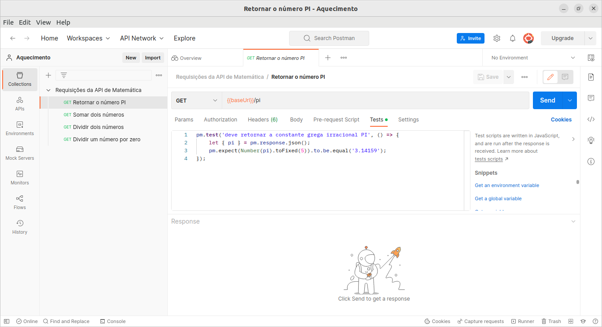

# aquecimento-api

## Sumário

- [aquecimento-api](#aquecimento-api)
  - [Sumário](#sumário)
  - [Motivação](#motivação)
  - [Pilha de tecnologia](#pilha-de-tecnologia)
  - [Galeria](#galeria)
  - [Como rodar](#como-rodar)
    - [Pré-requisitos](#pré-requisitos)
    - [Passo a passo](#passo-a-passo)

## Motivação

Este repositório consiste em uma API de uma calculadora. _A priori_, seu intuito é exemplificar o uso do framework Express e da plataforma Postman, além de abordar conceitos básicos de API como parâmetros em serviços de consulta e códigos de status de respostas. Também foi exportada a [coleção de requisições](./matematica.postman_collection.json) Postman com seus respectivos testes unitários escritos em sala de aula.

Este foi o primeiro repositório de código apresentado no [Curso Superior de TSI do IFMS](https://www.ifms.edu.br/campi/campus-aquidauana/cursos/graduacao/sistemas-para-internet/sistemas-para-internet) como requisito para obtenção da nota parcial das atividades da unidade curricular Linguagem de Programação III.

## Pilha de tecnologia

As seguintes tecnologias foram utilizadas para desenvolver este app:

| Papel | Tecnologia |
|-|-|
| Ambiente de execução | [Node](https://nodejs.org/en/) |
| Linguagem de programação | [TypeScript](https://www.typescriptlang.org/) |
| Framework de teste | [Postman](https://www.postman.com/) |

## Galeria



## Como rodar

### Pré-requisitos

- [Node](https://nodejs.org/en/download/);
- [Yarn](https://yarnpkg.com/) (opcional);
- [Postman](https://www.postman.com/) (opcional).

### Passo a passo

1. Clone o repositório de código em sua máquina;

2. Abra um shell de comando de sua preferência (prompt de comando, PowerShell, terminal _etc_.);

3. Instale as dependências do projeto através do seguinte comando:

```console
$ npm install
```

Caso esteja utilizando o gerenciador de pacotes Yarn, execute o seguinte comando como alternativa:

```console
$ yarn
```

4. Execute o seguinte comando para iniciar o app:

Para npm:

```console
$ npm run dev
```

Para Yarn:

```console
$ yarn dev
```

5. Abra o Postman e importe o arquivo de coleção Postman [`matematica.postman_collection.json`](./matematica.postman_collection.json) para executar os testes unitários dos serviços de consulta;

Como alternativa ao Postman, você pode instalar as dependências globais [`newman`](https://npmjs.com/package/newman) e [`newman-reporter-htmlextra`](https://npmjs.com/package/newman-reporter-htmlextra) para gerar relatórios via interface linha de comando e interface visual, respectivamente.